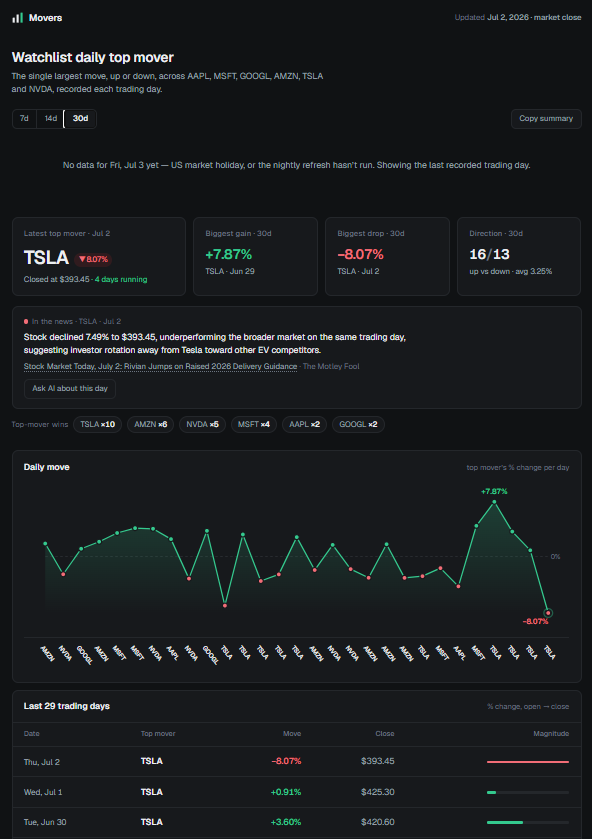
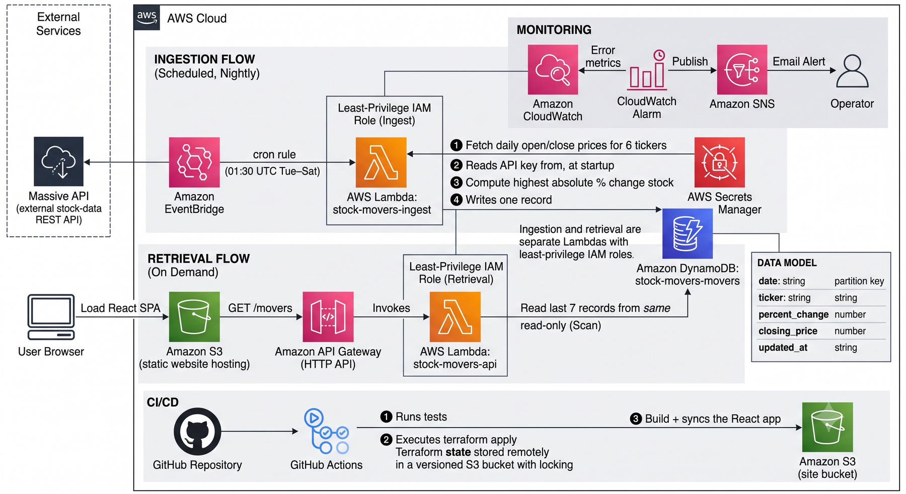

# Daily Stock Movers

A fully automated serverless pipeline on AWS that records, every trading day, which stock
from a fixed tech watchlist (AAPL, MSFT, GOOGL, AMZN, TSLA, NVDA) moved the most —
highest absolute % change, up or down — and shows the 7-day history on a public dashboard.

**Live site:** http://stock-movers-site-393818036549.s3-website-us-east-1.amazonaws.com
**Live API:** https://5otcpnjj2f.execute-api.us-east-1.amazonaws.com/movers



## Architecture



The mover math: `((close − open) / open) × 100`, keeping the biggest absolute move
across the watchlist each day.

Ingestion (cron) and retrieval (API) are separate Lambdas with separate least-privilege
IAM roles: the ingest role can only `dynamodb:PutItem` on the table, the API role only
`dynamodb:Scan`.

## Repo layout

```
infra/       Terraform: DynamoDB, both Lambdas, EventBridge, API Gateway, S3 site
src/ingest/  Daily ingestion Lambda (+ test_handler.py logic test)
src/api/     GET /movers retrieval Lambda
frontend/    React (Vite) dashboard
```

## Deploy from scratch

Prerequisites: Terraform ≥ 1.5, AWS CLI configured (`aws configure`), Node ≥ 20,
and a free [Massive](https://massive.com) API key.

```bash
# 0. One-time bootstrap: the bucket that holds Terraform's remote state
#    (Terraform can't store state in a bucket it hasn't created yet)
aws s3api create-bucket --bucket stock-movers-tfstate-<YOUR_ACCOUNT_ID> --region us-east-1
aws s3api put-bucket-versioning --bucket stock-movers-tfstate-<YOUR_ACCOUNT_ID> \
  --versioning-configuration Status=Enabled

# 1. Infrastructure
cd infra
cp terraform.tfvars.example terraform.tfvars   # paste your Massive API key inside
terraform init                                  # connects to the S3 backend
terraform apply                                 # creates everything; note the outputs

# 2. Frontend
cd ../frontend
npm ci
npm run build
aws s3 sync dist "s3://$(terraform -chdir=../infra output -raw site_bucket)"

# 3. Open the site
terraform -chdir=../infra output -raw site_url
```

The pipeline then runs itself: the cron fires nightly and appends one row per trading day.

To ingest a specific past date manually (e.g. to backfill):

```bash
aws lambda invoke --function-name stock-movers-ingest \
  --cli-binary-format raw-in-base64-out \
  --payload '{"date":"2026-06-25"}' out.json
```

## Beyond the brief

- **History window** — the dashboard can switch between 7/14/30 days (`?days=N` on the API).
- **Streak + leaderboard** — the dashboard calls out when one ticker tops the list several
  days running, and counts each ticker's "wins" over the window.
- **Volatility read** — average absolute daily move over the window.
- **Copy summary** — one-click clipboard summary of the latest mover.
- **Holiday awareness** — if the latest expected trading day has no data (market holiday
  or delayed refresh), the dashboard says so instead of silently showing stale numbers.
- **Manual backfill** — the ingest Lambda accepts `{"date": "YYYY-MM-DD"}` to repair gaps.
- **Related headline** — ingestion also grabs the day's most recent news article for the
  winning ticker (Massive `/v2/reference/news`), preferring articles that specifically
  analyze that ticker; their per-ticker sentiment reasoning is shown as the explanation,
  with a green/red sentiment dot. Labeled "related", not causal — a same-day headline
  isn't proof of why a stock moved. Best-effort: if the news call fails, the mover is
  stored without it. Click any table row to see that day's news.
- **Day-explainer AI chat** — `POST /chat` (same Lambda) answers questions about a
  recorded day using Gemini, grounded in that day's stored facts. The key lives in
  Secrets Manager; the endpoint validates input (max 12 messages of 500 chars), returns
  proper 400/404/502s, and the UI flags replies as commentary, not financial advice.

## API

`GET /movers` → last 7 recorded days, newest first (`?days=N`, 1–30, for a different
window; non-integer `days` returns 400):

```json
{
  "movers": [
    { "date": "2026-06-30", "ticker": "TSLA", "percent_change": 3.5961,
      "closing_price": 420.6, "updated_at": "2026-07-02T00:10:18Z" }
  ],
  "count": 1
}
```

Responses carry `Cache-Control: max-age=300` (the data changes once a day) and the stage
is throttled to 5 req/s so the public endpoint can't exhaust free-tier usage.

## Error handling

- **Rate limits (HTTP 429)** — Massive's free tier allows 5 requests/min for a 6-ticker
  watchlist. The ingest Lambda retries with 30/60/90 s backoff, so even a fully spent
  minute budget recovers by the second retry.
- **Read timeouts / transient network errors** — caught and retried alongside 429s.
- **Non-trading days (404)** — skipped; nothing is stored, the run exits cleanly.
- **"Data not ready" (403)** — the free tier refuses same-day data until end of day; the
  Lambda detects this and steps back one weekday automatically.
- **DynamoDB failure at read time** — API returns 502 with a JSON error body instead of
  crashing.

## Security

- No secrets in the repo: the Massive key lives in `terraform.tfvars` (gitignored),
  which Terraform stores in **AWS Secrets Manager**; the Lambda receives only the
  secret's ARN and fetches the value at cold start.
- Least-privilege IAM per function (write-only vs read-only on the one table; the
  ingest role can additionally read exactly one secret).
- A **CloudWatch alarm** on ingest Lambda errors emails via SNS if a nightly run fails.
- CORS on the API is locked to the site origin (plus localhost dev ports), not `*`.
- The S3 bucket policy allows public `GetObject` only — required for static website
  hosting.

## CI/CD

On every push to `main`, GitHub Actions:
1. runs the ingest and API logic tests,
2. applies the Terraform (state lives in S3 with native locking, so CI and any
   developer machine share one source of truth),
3. builds the frontend and syncs it to S3.

Required repo secrets: `AWS_ACCESS_KEY_ID`, `AWS_SECRET_ACCESS_KEY`,
`MASSIVE_API_KEY`, `GEMINI_API_KEY`, `ALERT_EMAIL`.

## Trade-offs

- **One manual bootstrap step.** Terraform state lives in a versioned S3 bucket with
  native locking, so CI and developers share one source of truth — but that bucket
  itself must be created once by CLI, since Terraform can't store state in a bucket
  it hasn't created yet. A known and accepted chicken-and-egg in every Terraform setup.
- **DynamoDB `Scan` in the API.** The table gains one small row per trading day, so a
  scan is effectively free; a GSI + Query would be warranted past ~1k rows.
- **HTTP-only site URL.** S3 website endpoints don't support HTTPS; CloudFront in front
  would add TLS and was skipped to stay within the brief's scope.
- **Sequential ticker fetches.** Parallelizing would hit the 5 req/min limit harder, not
  faster — the rate limit, not I/O, is the bottleneck.
- **The chart mixes tickers.** A classic market chart plots one instrument; ours plots
  "whoever moved most each day," so the line hops between stocks. Each point is
  labeled with its ticker (axis + crosshair) to keep that honest — the line shows the
  week's volatility shape, the labels show who caused it.
